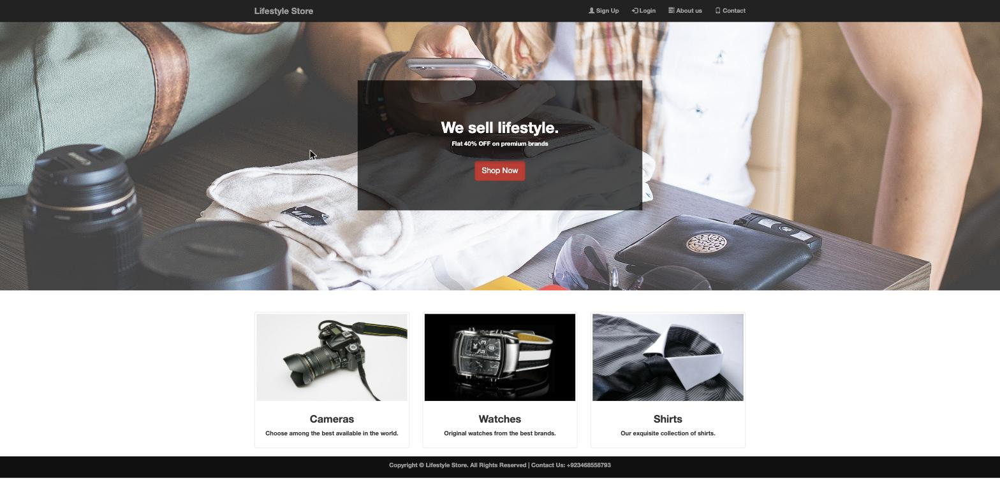
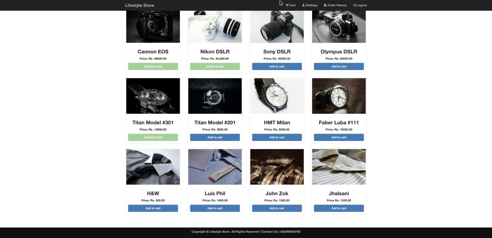
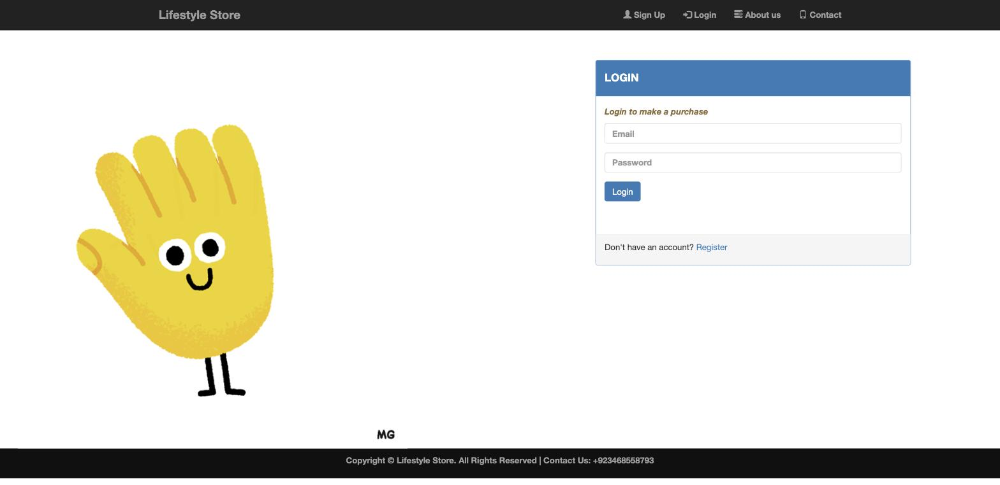
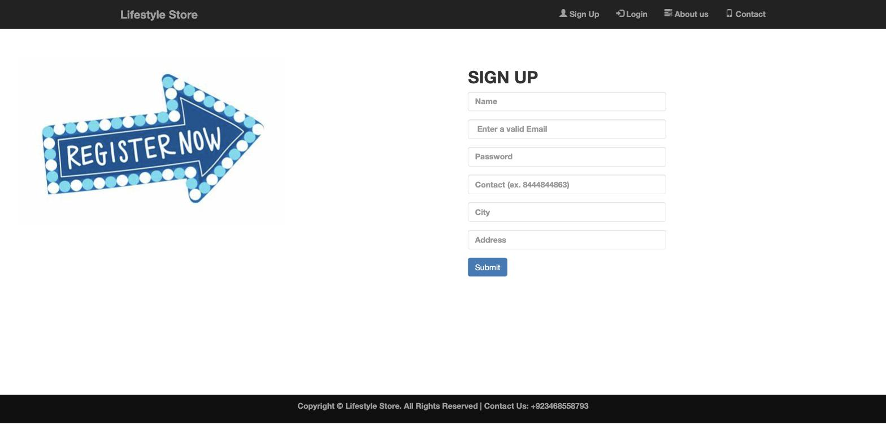
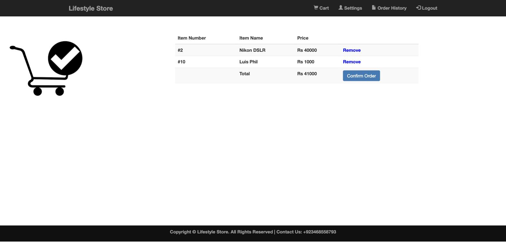
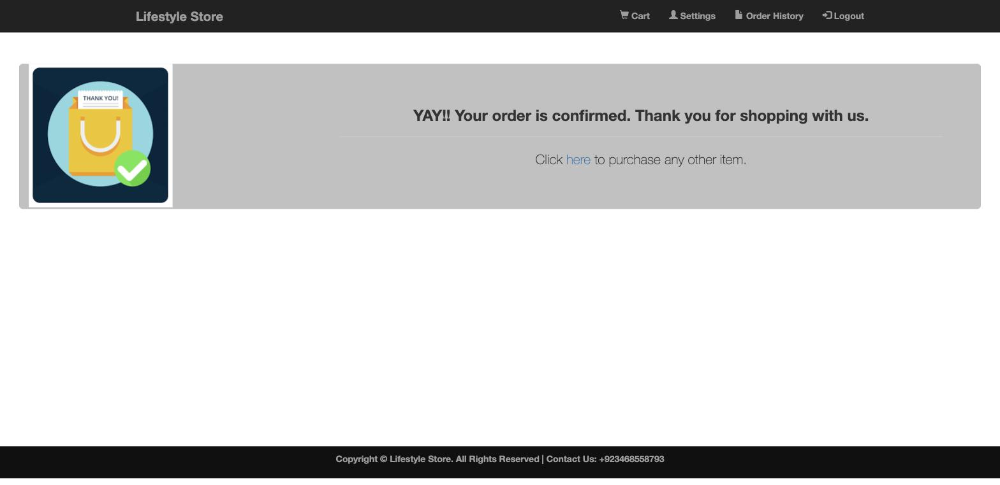
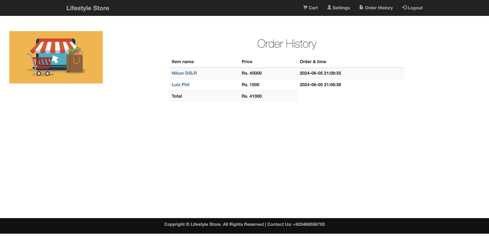
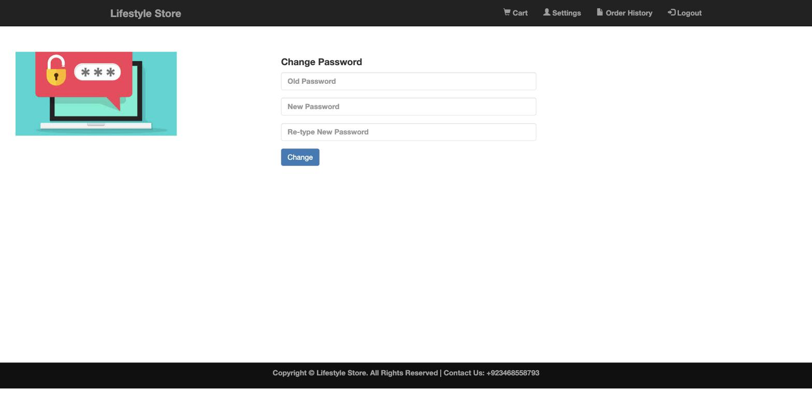
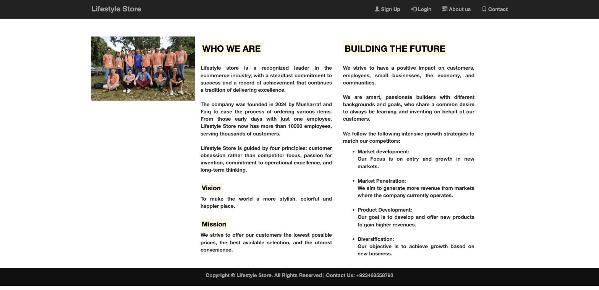
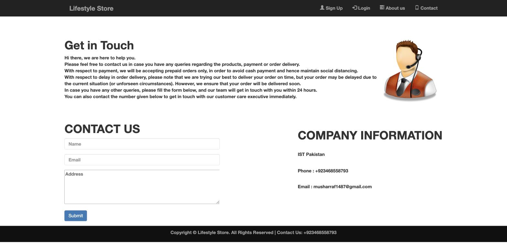

# Lifestyle Store — E-Commerce Website

A multi-page e-commerce web application built with **HTML, CSS, Bootstrap 3, jQuery, PHP and MySQL**.
Users can browse a product catalogue, register and log in, add items to a cart, confirm an order,
review their order history, and change their password.

Built as a Database Systems (DBS) course project.

---

## Table of Contents

- [Screenshots](#screenshots)
- [Features](#features)
- [Tech Stack](#tech-stack)
- [Project Structure](#project-structure)
- [Database Design](#database-design)
- [How It Works](#how-it-works)
- [Setup & Installation](#setup--installation)
- [Demo Accounts](#demo-accounts)
- [Known Limitations](#known-limitations)
- [Credits](#credits)

---

## Screenshots

### Home page
The landing page for visitors who are not logged in — hero banner plus the three product categories
(Cameras, Watches, Shirts), each linking into the matching anchor on the products page.



### Products page
The full catalogue of 12 items across three categories. When a user is logged in, each card shows an
**Add to cart** button; items already in the cart render as a disabled green **Added to cart** button.
Visitors who are not logged in see a **Buy Now** button that redirects them to the login page instead.




### Login


### Sign up
Client-side HTML5 `pattern` validation on name, e-mail, password strength and contact number, backed by
server-side regex validation in `signup_script.php`.



### Cart
Lists every item the user has added (status `Added to cart`), computes the running total, and offers a
per-row **Remove** link plus a **Confirm Order** action.



### Order confirmation


### Order history
Every confirmed order for the logged-in user, with price and timestamp.



### Settings — change password


### About us


### Contact


---

## Features

| Area | Description |
| --- | --- |
| **User registration** | Sign-up form with e-mail, password-strength and phone-number validation. Duplicate e-mails are rejected. |
| **Authentication** | Session-based login/logout. Passwords are hashed before being stored. |
| **Product catalogue** | 12 products in 3 categories (Cameras, Watches, Shirts), served from the `items` table. |
| **Product search** | Search by name with category, price-range and sort filters. Built on prepared statements, so search input is bound rather than interpolated. |
| **Shopping cart** | Add and remove items, live total calculation, and a guard so the same item cannot be added twice. |
| **Order placement** | Confirming the cart flips those rows to `Confirmed` and shows a thank-you page. |
| **Order history** | Table of all confirmed orders for the logged-in user, with timestamps and a grand total. |
| **Account settings** | Change password with old-password verification and new-password confirmation. |
| **Access control** | Cart, settings, order history and success pages redirect guests back to the home page. |
| **Adaptive navbar** | The header renders a different menu depending on whether a session is active. |
| **Responsive layout** | Bootstrap 3 grid, so the site reflows on tablets and phones. |

---

## Tech Stack

| Layer | Technology |
| --- | --- |
| Front end | HTML5, CSS3, Bootstrap 3, jQuery |
| Back end | PHP (procedural, `mysqli`) |
| Database | MySQL / MariaDB |
| Server | Apache (XAMPP / MAMP / WAMP) or PHP's built-in dev server |

---

## Project Structure

```
.
├── index.php              # Landing page (redirects to products.php if logged in)
├── products.php           # Product catalogue with add-to-cart buttons
├── search.php             # Product search with category/price/sort filters
├── login.php              # Login form
├── login_submit.php       # Verifies credentials, creates the session
├── signup.php             # Registration form
├── signup_script.php      # Validates input and inserts the new user
├── logout_script.php      # Destroys the session
├── cart.php               # Cart contents + running total + Confirm Order
├── cart-add.php           # Inserts an item into the cart
├── cart-remove.php        # Deletes an item from the cart
├── success.php            # Marks cart rows Confirmed, shows thank-you page
├── order.php              # Single-order confirmation view
├── order_script.php       # Inserts an item directly as a confirmed order
├── orderhistory.php       # Lists all confirmed orders for the user
├── settings.php           # Change-password form
├── settings_script.php    # Verifies the old password and updates it
├── aboutus.php            # Static About page
├── contact.php            # Static Contact page + enquiry form
│
├── includes/
│   ├── common.php         # DB connection + session bootstrap (required by every page)
│   ├── header.php         # Navbar, rendered per login state
│   ├── footer.php         # Footer + Google Translate widget
│   ├── check-if-added.php # check_if_added_to_cart($item_id) helper
│   └── product-card.php   # render_product_card($item) thumbnail renderer
│
├── database/
│   ├── store.sql          # Schema + seed data (phpMyAdmin dump)
│   └── migrations/
│       └── 001_add_product_search.sql   # Adds items.category, items.image + indexes
│
├── css/                   # bootstrap.css, bootstrap.min.css, style.css, index.css
├── js/                    # jquery.js, bootstrap.js, bootstrap.min.js
├── fonts/                 # Glyphicons webfont files used by Bootstrap
├── img/                   # Product photos, banners and page illustrations
└── screenshots/           # Interface screenshots used in this README
```

---

## Database Design

The database is named **`store`** and holds three tables.

### `items` — the product catalogue

| Column | Type | Notes |
| --- | --- | --- |
| `id` | `int(11)` | Primary key, auto-increment |
| `name` | `varchar(255)` | Product name |
| `price` | `int(11)` | Price in rupees |

### `users` — registered customers

| Column | Type | Notes |
| --- | --- | --- |
| `id` | `int(11)` | Primary key, auto-increment |
| `name` | `varchar(255)` | Full name |
| `email` | `varchar(255)` | Used as the login identifier |
| `password` | `varchar(255)` | Stored as an MD5 hash |
| `contact` | `varchar(255)` | 10-digit phone number |
| `city` | `varchar(255)` | |
| `address` | `varchar(255)` | |

### `user_item` — the join table (cart *and* order lines)

| Column | Type | Notes |
| --- | --- | --- |
| `id` | `int(11)` | Primary key, auto-increment |
| `user_id` | `int(11)` | References `users.id` |
| `item_id` | `int(11)` | References `items.id` |
| `status` | `enum('Added to cart','Confirmed')` | `1` = in cart, `2` = ordered |
| `date_time` | `datetime` | Defaults to `CURRENT_TIMESTAMP` |

This single table models the **many-to-many** relationship between users and items. The `status`
column is what separates a *cart* from an *order* — there is no separate orders table. A row starts
life as `Added to cart` and is promoted to `Confirmed` at checkout, and `date_time` therefore doubles
as the order timestamp.

```
users ──1───< user_item >───1── items
                  │
                  └── status: 'Added to cart' → cart
                             'Confirmed'     → order history
```

---

## How It Works

### Bootstrapping every request

Every page starts with `require("includes/common.php")`, which opens the `mysqli` connection and
starts the PHP session if one is not already running. The session carries two values — `$_SESSION['email']`
and `$_SESSION['user_id']` — and their presence is what the whole app treats as "logged in".

### Registration → login

1. `signup.php` posts to `signup_script.php`.
2. The script escapes every field, hashes the password, and checks that the e-mail is not already
   taken and that the e-mail and phone number match their regexes.
3. On success the user row is inserted and the visitor is sent to `login.php`.
4. `login_submit.php` hashes the submitted password and looks for a matching `email` + `password`
   row. A hit populates the session and redirects to `products.php`; a miss bounces back to
   `login.php` with an error message in the query string.

### Browsing and the cart

`products.php` includes `check-if-added.php`, which exposes `check_if_added_to_cart($item_id)`.
For each of the 12 product cards the page decides between three states:

- **not logged in** → a *Buy Now* button pointing at `login.php`
- **logged in, already in cart** → a disabled green *Added to cart* button
- **logged in, not in cart** → an *Add to cart* link to `cart-add.php?id=<item_id>`

`cart-add.php` inserts a `user_item` row with `status = 1`; `cart-remove.php` deletes the matching
row. Both redirect straight back so the page always reflects current state.

### Checkout

`cart.php` joins `user_item` to `items` to list the cart and sum the prices, and builds a
*Confirm Order* link carrying the item IDs. `success.php` then runs a single `UPDATE` that flips
those rows from status `1` to status `2`, which is what makes them appear in `orderhistory.php`.

### Access control

Pages that require a session (`cart.php`, `settings.php`, `orderhistory.php`, `success.php`,
`order.php`) begin with an `isset($_SESSION['email'])` check and redirect guests to `index.php`.
`index.php`, `login.php` and `signup.php` do the inverse — a logged-in visitor is pushed on to
`products.php`.

---

## Setup & Installation

### 1. Get a PHP + MySQL environment

Install **[XAMPP](https://www.apachefriends.org/)** (or MAMP / WAMP / a LAMP stack) — anything that
gives you Apache, PHP and MySQL.

### 2. Place the project in the web root

Clone or copy this folder into your server's document root:

```bash
# XAMPP on Windows
git clone <your-repo-url> C:/xampp/htdocs/lifestyle-store

# XAMPP on macOS
git clone <your-repo-url> /Applications/XAMPP/htdocs/lifestyle-store

# MAMP on macOS
git clone <your-repo-url> /Applications/MAMP/htdocs/lifestyle-store
```

### 3. Create and import the database

Start Apache and MySQL from your control panel, then either use phpMyAdmin
(`http://localhost/phpmyadmin` → **New** → database name `store` → **Import** → `database/store.sql`)
or the command line:

```bash
mysql -u root -p -e "CREATE DATABASE store;"
mysql -u root -p store < database/store.sql
```

### 4. Point the app at your database

Open `includes/common.php` and match the connection line to your setup:

```php
$con = mysqli_connect("localhost:3307", "root", "", "store") or die($mysqli_error($con));
//                     ^host:port       ^user  ^pass ^database
```

Defaults differ by stack — **XAMPP** and **WAMP** use port `3306` with user `root` and an empty
password; **MAMP** uses port `8889` with user `root` and password `root`. Change `3307` to whichever
port your MySQL is listening on.

### 5. Run it

```
http://localhost/lifestyle-store/index.php
```

<details>
<summary>Alternative: PHP's built-in server (no Apache needed)</summary>

If you have PHP and MySQL installed directly, you can skip Apache entirely:

```bash
mysql -u root -p -e "CREATE DATABASE store;"
mysql -u root -p store < database/store.sql
php -S localhost:8000
```

Then open `http://localhost:8000`.

</details>

---

## Demo Accounts

The dump ships with six seeded users. Their passwords are MD5 hashes, so if you want to log in with a
known password either register a fresh account through the sign-up page, or overwrite one:

```sql
UPDATE users SET password = MD5('YourPassword1') WHERE email = 'vish@gmail.com';
```

Note that the sign-up form requires a password of at least 8 characters containing an uppercase
letter, a lowercase letter and a digit, and a 10-digit phone number starting with 7, 8 or 9.

---

## Known Limitations

This is a learning project, and a few things would need to change before it went anywhere near
production:

- **SQL injection.** Values are escaped with `mysqli_real_escape_string()` and interpolated straight
  into query strings. Prepared statements (`mysqli_prepare` / `bind_param`) would be the correct fix.
- **MD5 password hashing.** MD5 is fast and unsalted, which makes it unsuitable for passwords.
  `password_hash()` / `password_verify()` are the modern replacements.
- **Database credentials in source.** `includes/common.php` hard-codes host, user and password;
  these belong in an untracked config file or environment variables.
- **Errors passed through the URL.** Error messages travel as raw HTML in query strings and are
  echoed back unescaped, which is an XSS vector.
- **No quantities.** The cart tracks *which* items were added, not how many, so an item can only be
  ordered once at a time.
- **Contact form is inert.** `contact.php` has no `action`, so submissions are not stored or e-mailed.
- **Order history timestamps.** `orderhistory.php` walks two independent result sets in parallel, so
  the timestamp column can fall out of step with the item rows when there are many orders.

---

## Credits

### Upstream project

This project builds on
[eCommerce-website-using-HTML-CSS-PHP-and-MySQL-database](https://github.com/VishwaduttMS/eCommerce-website-using-HTML-CSS-PHP-and-MySQL-database)
by Vishwadutt M S (2020), which supplied the original page set, the MySQL schema, and the
session/cart/order logic that this version still rests on. The upstream repository carries no
licence file, so it is used here for coursework rather than redistribution, and its original
commit history is preserved intact in this repository.

### Third-party components

- **Bootstrap 3** and **Glyphicons Halflings** — MIT licence
- **jQuery** — MIT licence
- Product and banner imagery — see `img/`

### What I contributed

- **Project structure.** Flat upstream root reorganised into `css/`, `js/`, `img/`, `fonts/`,
  `includes/`, `database/` and `screenshots/`, with all include paths rewritten to match.
- **Documentation.** This README — feature list, tech stack, schema walkthrough, request-flow
  explanation, setup instructions, demo accounts and a known-limitations audit — plus
  `screenshots/` covering all ten interface pages.
- **Branding and content.** Rebranded to *Lifestyle Store*: rewritten About and Contact page copy,
  new imagery, restyled layout, and updated contact details throughout.
- **Bug fixes.** Removed a stray `?>` in `includes/header.php` that rendered literally in the navbar
  for logged-in users; corrected the login page image reference (`img/source.GIF` → `img/source.gif`)
  so it resolves on case-sensitive filesystems.
- **Repository hygiene.** Added `.gitignore` and removed the committed `Thumbs.db`.

Across 91 files, the changes total roughly 9,800 insertions against the upstream baseline. To see
them directly:

```bash
git diff 9652f95 HEAD --stat
```
